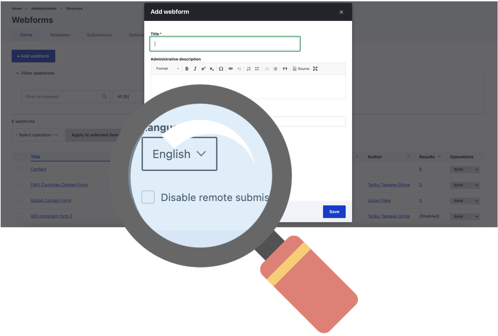

# 👋 Introduction


**URL:** [**https://webforms.unhcr.org/unhcr-login**](https://webforms.unhcr.org/unhcr-login)&#x20;


## Overview

UNHCR Webforms platform is developed and used to store webform submissions originating from unhcr.org website. the rationale is to disable submission of webforms on unhcr.org for the below reasons:

> **Security**: Centralizing form submissions on a dedicated Drupal instance enhances security by reducing the attack surface on the main site. This segmentation limits potential vulnerabilities and mitigates the impact of security breaches or malicious attacks, safeguarding sensitive data and maintaining the integrity of both sites.
>
> **Data Isolation** : Separating form submissions mitigates the risk of data overload on the main site and minimizes the potential for data conflicts or corruption. This approach enhances data integrity and simplifies data management by keeping form submissions distinct from other content types on the main site.
>
> **Performance**: By segregating form submissions to a separate Drupal instance, the main site's performance is optimized, particularly in scenarios with heavy traffic or numerous submissions. This architecture allows each Drupal instance to operate independently, ensuring consistent performance across both sites.
>
> **Ease of Maintenance**: Managing form submissions on a separate Drupal instance simplifies maintenance tasks, such as updates, backups, and troubleshooting. It also minimizes downtime and facilitates efficient administration, ensuring the continuous operation of both sites while minimizing disruptions to users and administrators.

## Webforms submission handling on UNHCR.org

Since submission of webforms is disabled on unhcr.org, the site is configured to handle submission in two ways

1. Send to email using email handler
2. Save to webforms.unhcr.org

<figure><figcaption></figcaption></figure>

