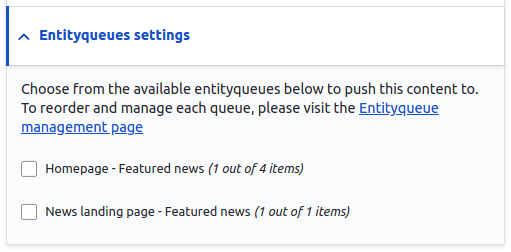

# Node form sidebar options

Any content type has a general setting in the side menu, this setting will be changed depending on the selected content type.

### Authoring Information

The default information is set to the node creation date, use this setting to override the creation date with a new one while this date is used in node pages, teasers and search pages.

### Meta tags

Use "Meta tags" to override the default meta tags for the current node.

### Menu Settings

Use "Menu Settings" to provide a menu link for the current node on any selected menu around the site.

1. Click on **Menu settings** in the side menu.
2. Check the “**Provide a menu link**” checkbox from the node settings.
3. Fill the fields for menu link: “**Menu link title**”, “**Description**”, “**Parent link**” and “**Weight**”.
4. Click **Save**.

### Simple XML Sitemap

Use "Simple XML Sitemap" to override the default XML sitemap settings for the current node.

 (1).png>)

### Search API Exclude

Use "Search API Exclude" to prevent the current node from indexing on the search page.

1. Click on **Search API Exclude** in the side menu.
2. Check the “**Prevent this node from being indexed**” checkbox from the node settings.
3. Click **Save**.

### URL Redirects

The URL redirects provide a list of all redirects on the current node and allow you to edit them. New redirects are created here using the "**Add URL redirect**" button which presents a form to simplify the creation of redirects.

### URL Alias

Once any node is created, an automatic URL is generated. To keep the website user-friendly, a URL alias is generated to mask the technical/numbered URL. This is referred to as the URL alias. In all content types on the site, a specific URL alias pattern has been determined and used. Site Admins have permission to edit the URL Alias to customize it further.

The following are steps on how to override the URL alias:

1. Click on **URL Alias** in the side menu.
2. Uncheck the “**Generate automatic URL alias**” checkbox from the node settings.
3. Edit the URL alias field.
4. Click **Save**.

### Entityqueues Settings

Use this setting to push the current node to a specific Entityqueue.

1. Click on **Entityqueues Settings** in the side menu.
2. Check the required Entityqueue from the listed checkboxes.
3. Click **Save**.

