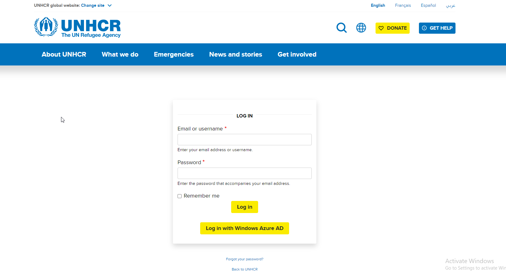

# Accessing the Administration Area

**Accessing and logging in to the administration area on Drupal is a simple process that requires just a few steps:**

1. Open your web browser and navigate to the login page of your Drupal website. The login page is usually located at "**https://\[Domain\_name]/user**" or "**https://\[Domain\_name]/user/login**".
2. On the login page, enter your username and password. If you don't have an administrator account, you will need to have one before you can log in.
3. After entering your username and password, click the "Log in" button to access the administration area.
4. If you are unable to log in, check to make sure that you are entering the correct username and password. If you have forgotten your password, you can reset it by clicking the "Request new password" link on the login page.
5. **OR,** use the Windows Azure account to log in by clicking on the "Log in with Windows Azure AD" button
6. Once you have successfully logged in, you will be redirected to the administration area of your Drupal website.

<figure><figcaption>
The Project site login page
</figcaption></figure>
