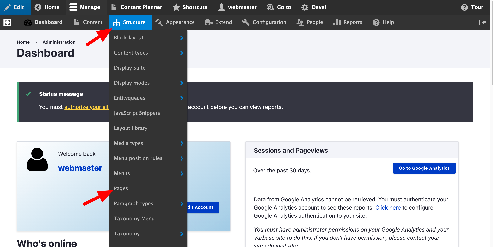

# Dashboard

This dashboard is built on top of [Total Control Admin Dashboard](https://www.drupal.org/project/total_control) module, utilizing Panels, [Google Analytics Reports](https://www.drupal.org/project/google_analytics_reports), and several enhanced blocks and widgets for an intuitive and flexible administration experience.\\

> The idea is made to provide the site admins with an appealing and concise dashboard to become the home of any Drupal site's administration task.

## How to Edit a Dashboard

To edit the current Dashboard follow these steps:

1. In the **Manage** administrative menu, navigate to **Structure**_>_**Pages**_._

2\. Click **edit** under **Total Control dashboard**_._

 (1).png>)

3\. Click on **Varbase Dashboard**_>_**Content**

.png>)

4\. Try to update the dashboard by:

* Reorder the default blocks \_\_ under \_\_ **the dashboard.** \_\_
* Add Variant
* Delete Page.
* Add new block

 (2).png>)

5\. Click **Update and save**\\

## Edit Current User Account from Dashboard

On the Dashboard page, user is able to edit his account information directly from the edit button on the top section.

.png>)


To edit the user information check **User Management** section > [**Edit user**](../../user-management/edit-user.md)\*\*\*\*

