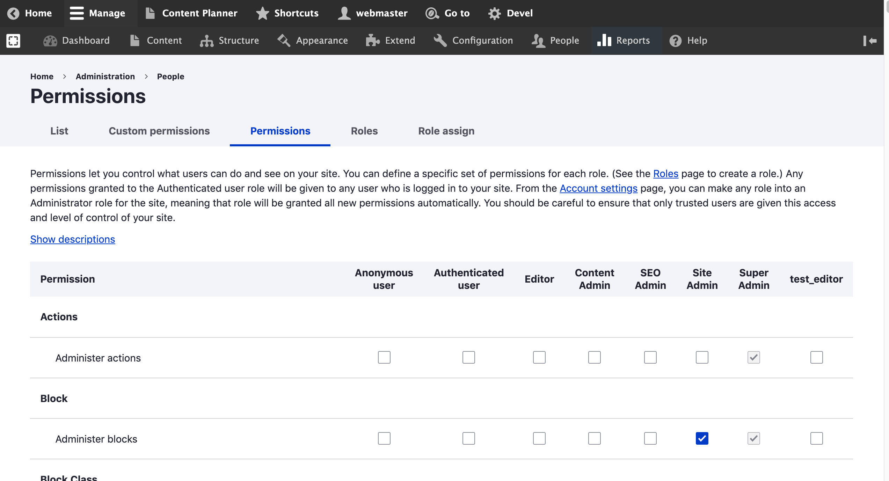

# Edit Roles' Permissions

To edit the permissions of any role, follow these steps:

1. In the **Manage** administrative menu, navigate to **People\\**_**Roles**_.
2. Click **Edit permissions** in the dropdown for any role you want\
   &#xNAN;_&#x54;he available permissions depend on the modules that are installed on the site_
3. Check the boxes for the permissions you want to grant. Permissions are listed by module
4. Click **Save permissions**.


**Note:** Some permissions may have security implications. Be cautious while assigning permissions to roles


