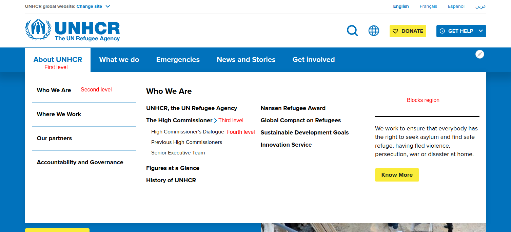
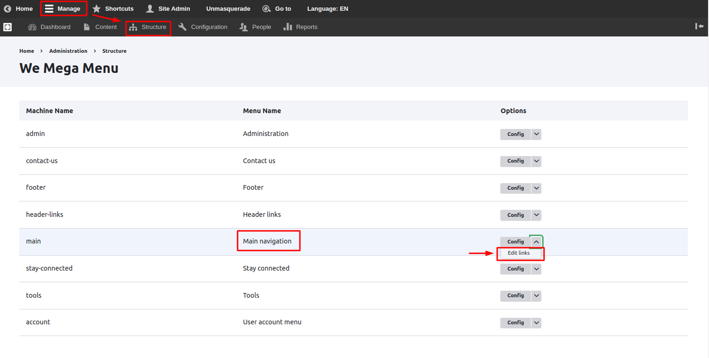
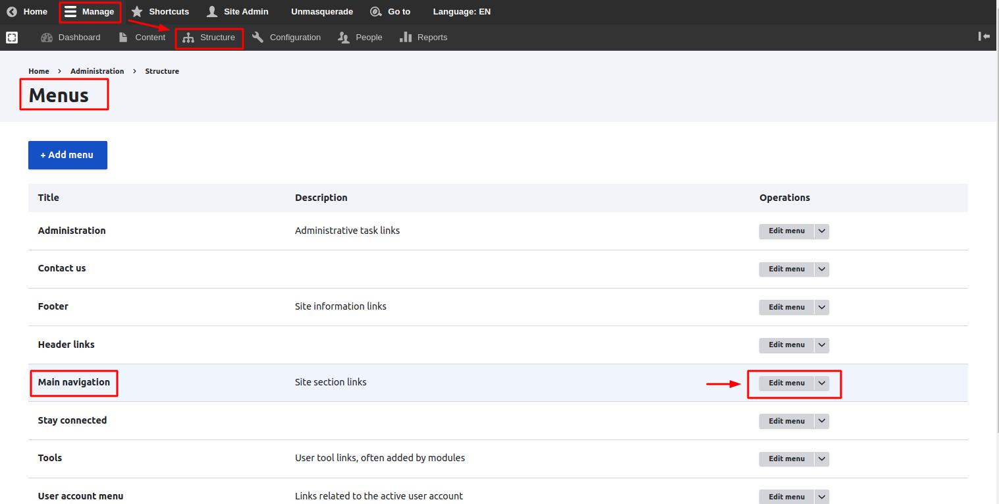
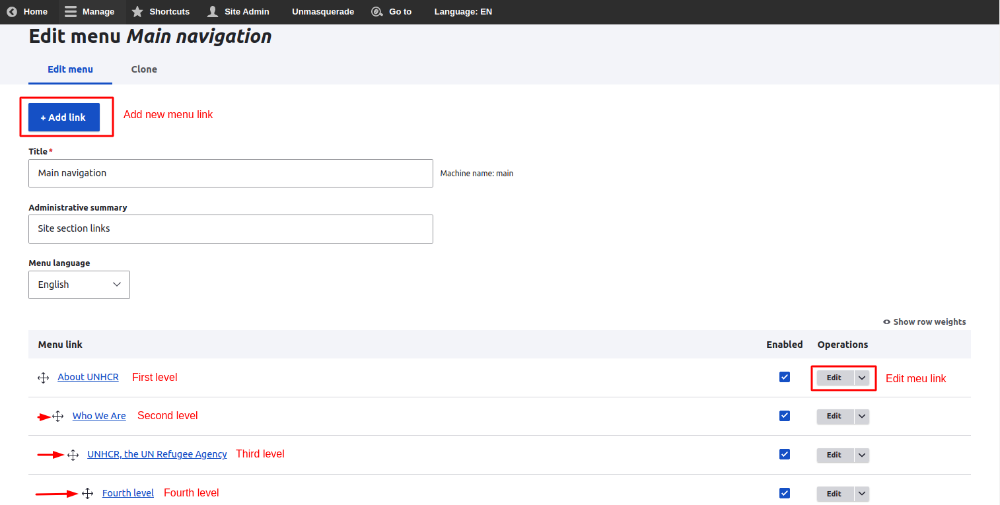
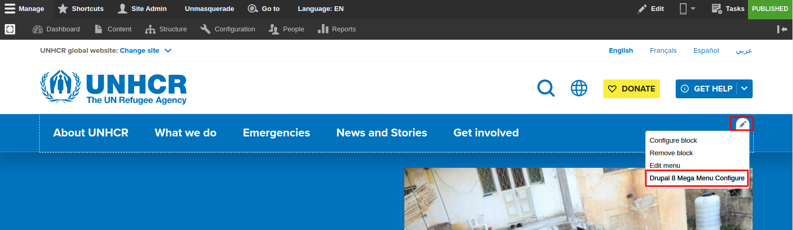
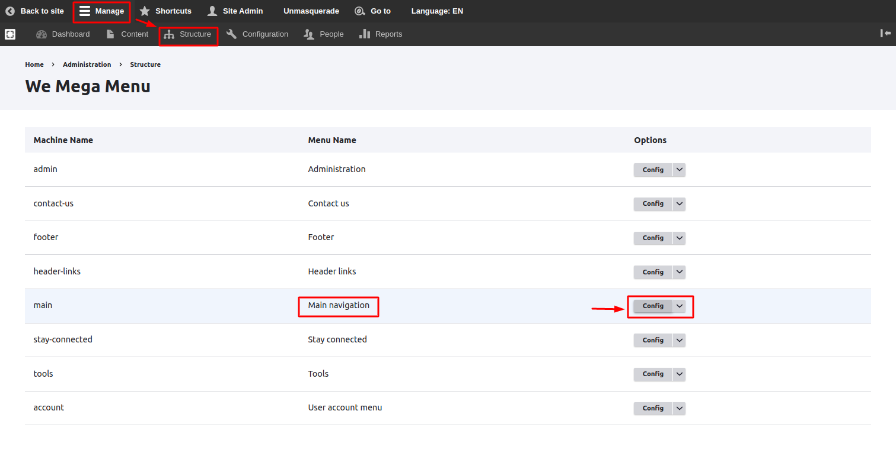
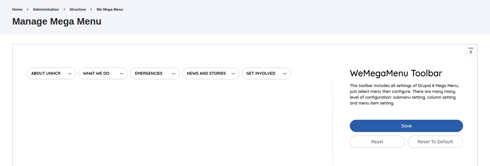
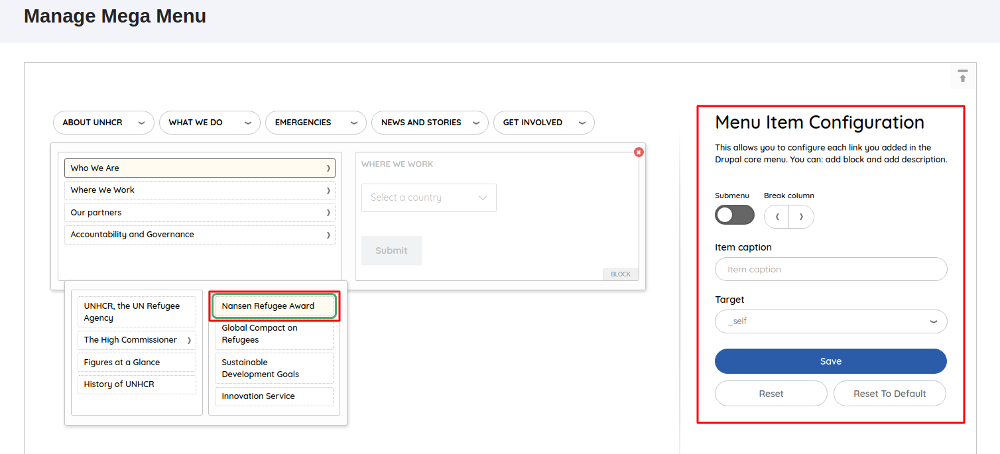
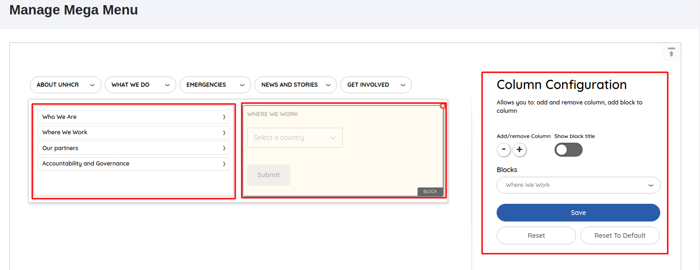

# Mega Menu

UNHCR mega menu consists of fourth levels, the first level looks like a standard list of links, but after hovering over one of its items, additional options are shown. These options consist of a list of the second level items additional to content blocks on the side which can be changed easily while moving between the first level items. When hovering over the second level items will show the third and fourth level items. A menu built in this way is visually appealing to the user and allows them to easily find their way around large websites.

Below you can see a screenshot of how the mega menu was built on UNHCR.

### Configuring Menu Links

We can find the main menu settings in two ways:

1. Select **Structure**/_**Mega Menu**_\*\* \*\* from the **Manage** administrative menu\*\*.\*\*
2. Look for the **Main navigation** element and from this element's menu, we go to **Edit links**.

OR! we can go to menu settings directly by:

1. Select **Structure**/_**Menus**_\*\* \*\* from the **Manage** administrative menu\*\*.\*\*
2. Locate the **Main navigation.**
3. Click on the **Edit menu.**

#### Editing Main Menu Links

After going to the **Edit menu/ \_Main navigation** \_ page, the working structure of the main menu appears, which allows the admin to freely add new menu links, edit existing ones and change menu link position using drag and drop. To add more levels to the menu, we need to move the second item to the right to create an "indentation".

#### Adding new menu link

1. Click **Add link**.
2. In the **Menu link title** field, enter the title as it will be displayed in the menu.
3. In the **Link** field, enter a path for the link. This can be an internal path such as existing nodes on the site or an external URL such as `http://example.com` or enter `<front>` to link to the front page.
4. In the **Description** field, enter the text that will be displayed when a user hovers over the link.
5. Enable any of the following options:

* **Enabled**: If the link is not enabled, it will not be displayed in the menu.
* **Show as expanded**: Ignored on the mega menu (used for simple menus only).
* In the **Parent link** list, select the parent of the link.
* (Optional) In the **Weight** list, select the relative weight of the link. Links with the "lightest" weight will display higher in a menu. Links with the same weight will display in alphabetical order.
* Click **Save**.

## Manage Mega Menu

You can manage the mega menu using a friendly configuration interface. The additional option is the possibility to add a few columns in the submenu with a list of blocks, set captions, and break menu items into multi-columns.

There are two options to reach the manage page:

#### **First option:**

1. Hover on the mega menu area in the header.
2. Click on the **Edit Pen**.
3. Choose **Drupal 8 Mega Menu Configure** from the list.

#### Second option:

1. Select **Structure/**_**Mega Menu**_\*\* \*\* from the **Manage** administrative menu\*\*.\*\*
2. Look for the **Main navigation** element.
3. Click **Config**.

### WeMageMenu Toolbar

Mega Menu UI consists of 2 parts:

**1. Mega Menu Area** simulates the megamenu frontend interface but has been simplified (without style). You will get what you see here. There are 3 types of clickable elements in the area. They are menu-item, submenu, column. Depending on the element you select, the Toolbox will display different configurations.

**2. Toolbox Area**: The area that allows you to config the selected element in the mega menu area. WeMageMenu Toolbar is displayed by default when you click on the space in the simulator.

* **Save**: Save the configs you have done.
* **Reset**: Go back to the last save.
* **Reset To Default**: Back to the original when you set up the main menu.


Be careful when using **Reset To Default** as this action can't be undone.


### Mega Menu Items Configuration

Click a **Menu item** to display the **Menu Item Configuration** tab.

**Toolbox Area**

* **Submenu**: You can enable/disable the submenu for this item, the option will be hidden when the menu already has children's menu items.
* **Break column**: This allows you to move a list of menu items to another column, Available only for the third level.
* **Item caption**: Add a caption to the menu items.
* **Target**: To specify where to open the linked item.

### Column Configuration

Click **Column of Submenu** to display **Column Configuration** tab, these configs allowed for the first level only.

**Toolbox Area**

* **Add/remove Column**: "+" to add a new column to the right of the selected column. "-" to remove the selected column.
* **Blocks**: Add/replace a block to the selected column.
* **Show block title**: Show/hide the block selected above.
