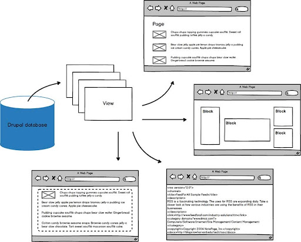

# Views

The views module allows administrators and site designers to create, manage, and display lists of content. Each list managed by the views module is known as a "view", and the output of a view is known as a "display".

Displays are provided in either block or page form, and a single view may have multiple displays. Optional navigation aids, including a system path and menu item, can be set for each page-based display of a view. By default, views may be created that list content (a Node view type), content revisions (a Node revisions view type), or users (a User view type).

A view may be restricted to members of specific user roles, and maybe added, edited, or deleted at the views administration page.

Since 8.x Drupal provides views bundled with core, this module is used to manage most of the content listing around the site, most views utilize Drupal’s core cache tags for better performance and scalability.

Views for this site can be configured by visiting this URL: [https://mvp.unhcr.info/admin/structure/views](https://mvp.unhcr.info/admin/structure/views)


**Views UI should be disabled in production environments because of performance implications.**


For more information about Views please check the official documentation [**https://www.drupal.org/docs/8/core/modules/views**](https://www.drupal.org/docs/8/core/modules/views)
