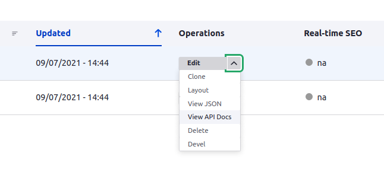
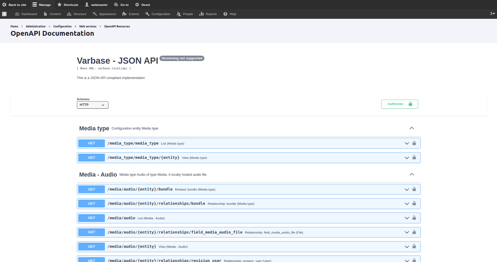

# Configuring JSON:API Features

The **JSON:API** module comes with **Drupal core** out of the box. It exposes entities as a **JSON:API-specification-compliant** web API.

**Varbase API** module assembles a better **JSON:API** starter kit implementation. With authentication and authorization. Allows for easy ingestion of content by other applications.


[https://github.com/UNHCR-WEB/drupal-platform-docs/blob/master/developers/configuring-a-varbase-site/broken-reference/README.md](https://github.com/UNHCR-WEB/drupal-platform-docs/blob/master/developers/configuring-a-varbase-site/broken-reference/README.md)


## A Specification for Building APIs in JSON


If you’ve ever argued with your team about the way your JSON responses should be formatted, JSON:API can be your anti-[bikeshedding](http://bikeshed.org) tool.�

Read more at: [https://jsonapi.org](https://jsonapi.org)


## Drupal Core JSON:API Module

The JSON:API module is a Drupal-centric implementation of the JSON:API specification. By its own definition, the JSON:API specification "is a specification for how a client should request that resources be fetched or modified, and how a server should respond to those requests.

Designed to minimize both the number of requests and the amount of data transmitted between clients and servers. This efficiency is achieved without compromising readability, flexibility, or discoverability.


Read more at:

[https://www.drupal.org/docs/core-modules-and-themes/core-modules/jsonapi-module](https://www.drupal.org/docs/core-modules-and-themes/core-modules/jsonapi-module)


## �Varbase API Settings


On top of **JSON:API** settings and configs. Varbase brings more configs for easier accessibility. Extra JSON:API specifications and better API documentation for developers.


Having a permission `"Administer Varbase API settings"` to access Varbase API settings and generate keys page.

Navigate to `"/admin/config/system/varbase/api"` to change the default Varbase API settings

.png>)

Check the expose a **"View JSON"** or **"View API Docs"** link in entity operations check boxes to list them in entity operation actions in the content page.

## **View API Docs and View JSON Entity Operations**

* Having a permission `"Access View JSON entity operation"` to let site admins see the `View JSON` link in entity operations.
* Having a permission `"Access View API Docs entity operation"` to let site admins `View API Docs` link in entity operations.
* Showing or hiding the `"View JSON"` and `"View API Docs"` links is based on enabled or disabled \_\_ **JSON:API resource types**. Which maps only to active endpoints for entity types and bundles.



### Auto Enabled JSON:API Endpoints for Entity Types

Select the desired Auto Enabled JSON:API Endpoints for Entity Types. Checked entity types will dynamically re-configured on creation of new entity types or entity config types.

Other not checked entity types will not have a new JSON:API endpoints by default.

.png>)

### Generate keys

Having an advanced authentication and authorization with private and public ssh keys.

The key generation form provided by **Simple OAuth** doesn't generate unique key names (or allow the user to override the names) and doesn't allow the user to specify the location of the **OpenSSL** config file. Specifically, the fact that the names are always the same could cause problems on systems where the home directory stores keys for more than one application. So hide the link to that form and users can continue to use the one provided by Varbase API.

Navigate to `"/admin/config/system/varbase/api/keys"` to generate keys configurations.

.png>)

## **Managing JSON:API Resource Overrides**

Use the overwrite operation to overwrite a resource type's configuration. You can revert back to the default configuration using the revert operation.

Navigate to `"/admin/config/services/jsonapi/resource_types"` for overwriting a resource type's configuration. Revert back to the default configuration using the revert operation.

.png>)

## **Browsing OpenAPI Documentation For JSON API**

A document (or set of documents) that defines or describes an API. An OpenAPI definition uses and conforms to the OpenAPI Specification.

Path templating refers to the usage of template expressions, delimited by curly braces (`{}`), to mark a section of a URL path as replaceable using path parameters.

The **OpenAPI Specification** (OAS) defines a standard, language-agnostic interface to **RESTful APIs** which allows both humans and computers to discover and understand the capabilities of the service without access to source code, documentation, or through network traffic inspection. When properly defined, a consumer can understand and interact with the remote service with a minimal amount of implementation logic.

An **OpenAPI** definition can then be used by documentation generation tools to display the API, code generation tools to generate servers and clients in various programming languages, testing tools, and many other use cases.

### Varbase API list the the following entity types by default:

* Content Types
* Media
* Taxonomy

Navigate to `"/admin/config/services/openapi/swagger/jsonapi"` in the site to browse the **OpenAPI Documentation**.



## Example API Endpoint After Installation

* Build a Varbase project website with a local domain `http://varbase.local` pointing at the path of the project.
* Install all Varbase components, with Extra components and optional components too.
* Make sure that the **Varbase API** module was enabled.
* Navigate to `http://varbase.local/api` URL in a any browser. Or use any API testing platforms.
* The API link should show empty list of endpoints. except allowed and default configured by Varbase API.

```
{
   "jsonapi":{
      "version":"1.0",
      "meta":{
         "links":{
            "self":{
               "href":"http:\/\/jsonapi.org\/format\/1.0\/"
            }
         }
      }
   },
   "data":[
      
   ],
   "links":{
      "media--audio":{
         "href":"http:\/\/varbase.local\/api\/media\/audio"
      },
      "media--file":{
         "href":"http:\/\/varbase.local\/api\/media\/file"
      },
      "media--gallery":{
         "href":"http:\/\/varbase.local\/api\/media\/gallery"
      },
      "media--image":{
         "href":"http:\/\/varbase.local\/api\/media\/image"
      },
      "media--instagram":{
         "href":"http:\/\/varbase.local\/api\/media\/instagram"
      },
      "media--remote_video":{
         "href":"http:\/\/varbase.local\/api\/media\/remote_video"
      },
      "media--tweet":{
         "href":"http:\/\/varbase.local\/api\/media\/tweet"
      },
      "media--video":{
         "href":"http:\/\/varbase.local\/api\/media\/video"
      },
      "media_type--media_type":{
         "href":"http:\/\/varbase.local\/api\/media_type\/media_type"
      },
      "node--landing_page":{
         "href":"http:\/\/varbase.local\/api\/node\/landing_page"
      },
      "node--landing_page_lb":{
         "href":"http:\/\/varbase.local\/api\/node\/landing_page_lb"
      },
      "node--page":{
         "href":"http:\/\/varbase.local\/api\/node\/page"
      },
      "node--varbase_blog":{
         "href":"http:\/\/varbase.local\/node\/varbase_blog"
      },
      "node--varbase_heroslider_media":{
         "href":"http:\/\/varbase.local\/api\/node\/varbase_heroslider_media"
      },
      "node_type--node_type":{
         "href":"http:\/\/varbase.local\/api\/node_type\/node_type"
      },
      "self":{
         "href":"http:\/\/varbase.local\/api"
      },
      "taxonomy_term--blog_categories":{
         "href":"http:\/\/varbase.local\/api\/taxonomy_term\/blog_categories"
      },
      "taxonomy_term--tags":{
         "href":"http:\/\/varbase.local\/api\/taxonomy_term\/tags"
      },
      "taxonomy_vocabulary--taxonomy_vocabulary":{
         "href":"http:\/\/varbase.local\/api\/taxonomy_vocabulary\/taxonomy_vocabulary"
      }
   }
}
```
