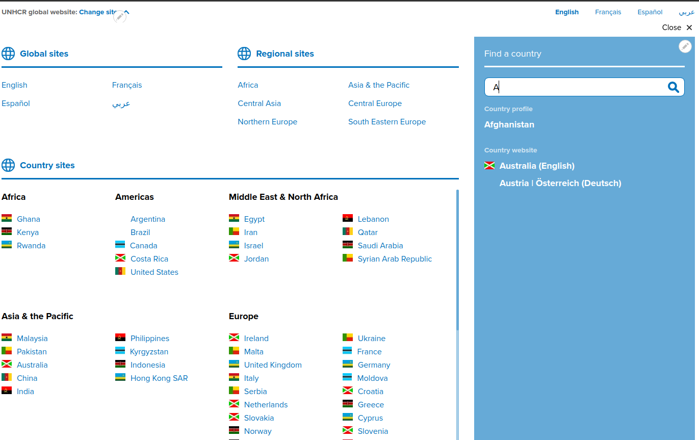

# Country Switcher

The country switcher is a component developed for the <mark style="color:blue;">unhcr.org</mark> project to allow the user to navigate between **Country sites** and **Country profiles** easily.

### Countries & Regional Sites

To manage countries there is a taxonomy vocabulary ([Country switcher - Sites links](https://mvp.unhcr.info/admin/structure/taxonomy/manage/sites/overview)) containing links/icons/title etc...

There are two levels of taxonomies here:

1. **First level taxonomy**: the links inside the term will be shown in the **Regional site**
2. **Second level taxonomy**: the links inside the term will be shown in the **country sites** and country website (search box).

Also, a custom module ([unhcr\_sites](modules/custom-modules.md)) was created to wrap all country switcher custom functionality and templates and JS code.
