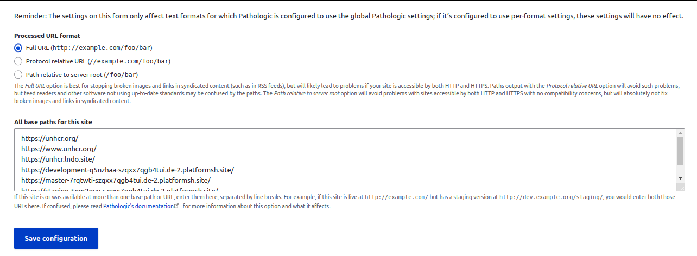

# Pathalogic

Pathologic is an input filter which can correct paths in links and images in your Drupal content in situations which would otherwise cause them to break; for example, if the URL of the site changes, or the content was moved to a different server.

### Requirements

* Avoid broken links and incorrect paths in content

### Configuring Pathologic

Pathologic stores configuration in two ways: globally, and per-text format. By default, when you add the Pathologic filter to a format, it will use the global configuration unless you configure it otherwise. In most cases, just sticking with global configuration will work fine, and reduces the potential for confusion resulting when Pathologic works one way with one text format and a different way with another.

#### Step 1: Modify the global configuration for Pathologic

* Go to **Configuration/Content authoring/**_**Pathologic Configuration**_

* Select the desired output format of Pathologic-processed paths from the **Processed URL format** field. The default configuration uses the **Full URL** option.
* Enter the paths of other/previous Drupal installations that are used in other environments or locally. Enter one path per line.

 (1) (1).png>)

* Click the **Save configuration** button.

#### Step 2: Set per-text format options for Pathologic

* Go to **Configuration/Content authoring/**_**Text formats and editors**_. Find the format you wish to set Pathologic options for, and click the corresponding **configure** link.

 (1) (1).png>)

* Find Pathologic’s settings in the **Filter settings** section of the format settings form. You’ll see a “Settings source” radio button with two options: “Use global Pathologic settings” and “Use custom settings for this text format.” Select the latter option.

 (2).png>)

* In the **Custom settings for this text format** section, configure Pathologic as above.
* Click the **Save configuration** button.
